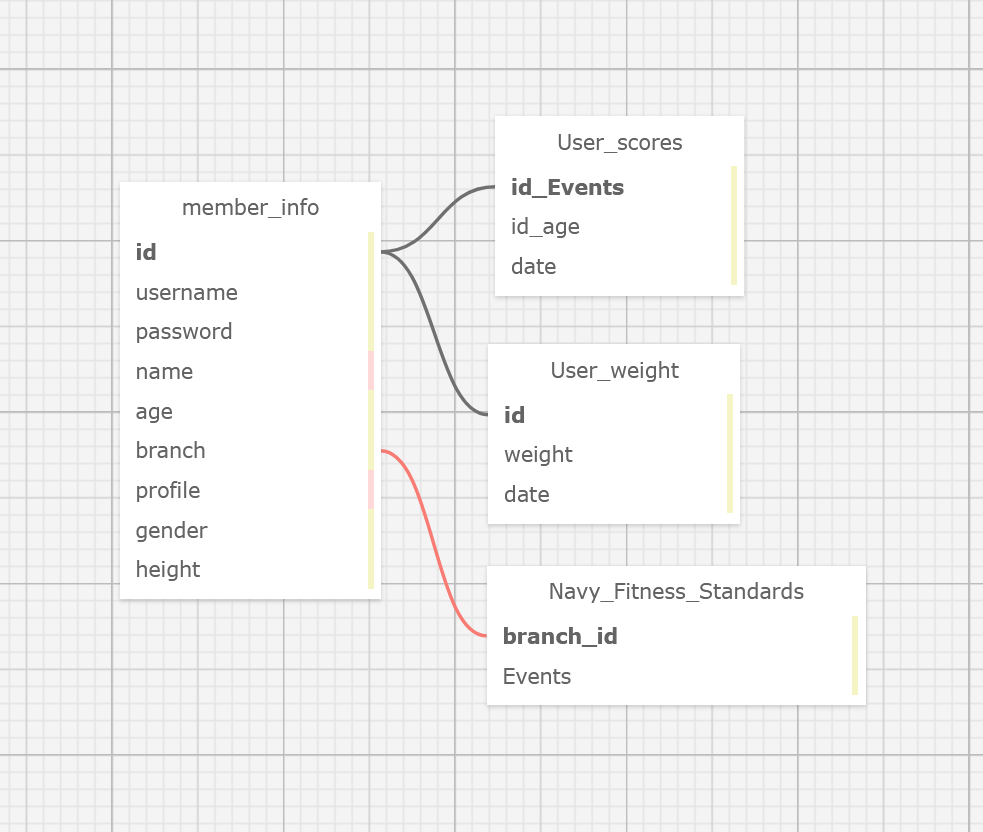

# H1 mFIT API
- This API contains a collection of 4 tables (member_info, navy_fitness_standards, user_weight, and user_scores) that allow the mFIT application to display relevant fitness data to the user. 

## H2 Table of Contents
- Schema Design
- Instructions
    -Server Setup
    -Table Data Format examples
- Available Service Endpoints
    -Get datasets
    -Post datasets
    -Patch datasets
    -Delete datasets
- Useful Tools
    -postgres commands
    -knex commands

## H2 Schema Design

## H2 Instructions

### H3 Server Setup:
- fork and clone this repo using git
- to install the back end service and dependencies, run `npm install` in the root of the `sdi-blended-workshop-databases-scaffold/` directory
- To start the server, run `npm start`
- The server will be available at `http://localhost:8080`

### H3 Table Data Format Examples

member_info
{
        "id": 4,
        "username": "user4",
        "password": "password",
        "name": "name4",
        "branch": "navy",
        "gender": "male",
        "heightinches": 70,
        "physicalLimitations": "no"
    }

user_weight
 {
        "id": 1,
        "date": "date",
        "weight": 180,
        "member_info_id": 1
    },

user_scores
    {
        "id": 1,
        "age": "17",
        "gender": "male",
        "category": "",
        "level": "",
        "points": "",
        "pushups": "92",
        "forearm_plank": "3:24",
        "run": "8:15",
        "row": "7:00",
        "swim_yard": "6:30",
        "swim_meter": "6:20",
        "date": "09/16/2022",
        "member_info_id": 1
    },

## H2 Available Service Endpoints

### H3 GET datasets 
`GET member_info` - returns a list of all members and their sign-up info
`GET navy_fitness_standards` - returns navy fitness standards by age, gender, and event
`GET user_scores` - returns user scores for PT test, with date
`GET user_weight` - returns user weight in pounds for user with date

### H3 POST datasets 
`POST member_info` - MUST input ALL member info criteria
`POST user_weight` - MUST input user weight in pounds and date of weigh in
`POST user_scores` - MUST input scores for each tested event and date of test

### H3 PATCH datasets 
`PATCH member_info` - MUST input ALL member info criteria
`PATCH user_weight` - MUST input user weight in pounds and date of weigh in
`PATCH user_scores` - MUST input scores for each tested event and date of test

### H3 DELETE datasets 
`DELETE member_info` - deletes 

## H2 Useful Tools

*Starting postgres*
- docker run --rm --name pg-docker -e POSTGRES_PASSWORD=docker -d -p 5432:5432 \
    -v $HOME/docker/volumes/postgres:/var/lib/postgresql/data postgres
-docker ps -a (shows all Docker images running)
-docker exec -it <PSQL-Container-ID> bash (navigate to container)
-psql -U postgres (login to psql shell as default postgres user)

 *useful run commands*
- docker exec -it be3 bash //access database in terminal via docker
- npx knex seed:run
- npx knex migrate:rollback
- npx knex migrate:latest
- npx knex migrate:up
- npx knex seed:make
- dumb shit:  //await knex.schema.raw('TRUNCATE <table> CASCADE')
- npm i dotenv 

